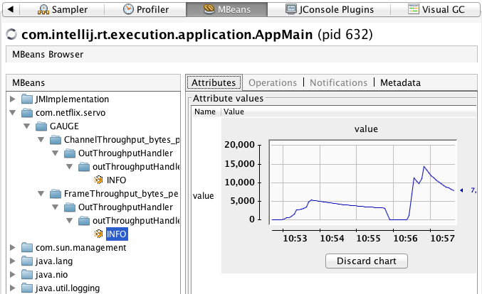

# Slow Light Proxy Server

## How to run
First, build the project with maven:

```
mvn clean install
```

Run *Slow Light Proxy Server* with

```
java -jar slowlight-proxy-<version>.jar config.json
```

## Sample configurations

### No delays, just proxying TCP/IP.
This configuration will run server on localhost:10011 and will proxy requests to google:80

```json
{
    "serverTypes" : {
        "simple" : "com.tacitknowledge.slowlight.proxyserver.server.simple.SimpleServer",
        "proxy" : "com.tacitknowledge.slowlight.proxyserver.server.proxy.ProxyServer"
    },

    "servers" : [
        {
            "id" : "proxyServerExample",
            "type" : "proxy",
            "localPort" : "10011",
            "params" : {
                "host" : "google.com",
                "port" : "80"
            },
            "handlers" : [
            ]
        }
    ]
}
```

The following are the key elements of Slow Light configuration:

* __serverTypes__ - this section allows to declared any available server implementations, in our case there are two *simple* and *proxy*.
Once a server implementation is declared here it can be used as server type in servers section.

* __servers__ - this is the main configuration section where we provide all server definitions that follow to be started by Slow Light.
Here we can have as many servers as we want. In our example we defined a proxy server which will listen on local port 10011 and will
pass all requests to the specified host and port from params attribute.

* __id__ - each server must have an unique id
* __type__ - this is the server type as defined in serverTypes section
* __localPort__ - the local port this server will listen on
* __params__ - params allows to define additional server parameters, those parameters depends directly on the server implementation,
in case of proxy server implementation those parameters are *host* and *port* what corresponds to the proxied remote server host and port.

* __handlers__ - a list of server handlers (or server handlers pipeline), those handlers play the most import role in defining server
behavior. Despite the fact that in our example this list is empty, normally this will be a list of meaningful handlers which will be
applied to requests in the order they are defined, and for responses in the reverse order. Also the list could be empty or may be missing
from the configuration in which case there will be no impact on the request/response, server will act as a simple proxy.

### Server implementations

* __com.tacitknowledge.slowlight.proxyserver.server.simple.SimpleServer__ - a server with no initial logic by default, someone
could define handlers pipeline as per desired behavior.
* __com.tacitknowledge.slowlight.proxyserver.server.proxy.ProxyServer__ - a server that will initially act as a proxy to the specified
target host, similar to the simple server behavior of the proxy server could be altered by defining handlers pipeline.

### Handlers implementations

* __com.tacitknowledge.slowlight.proxyserver.handler.CloseConnectionChannelHandler__ - closes connection after a given time
* __com.tacitknowledge.slowlight.proxyserver.handler.DelayChannelHandler__ - delays response data by specified time
* __com.tacitknowledge.slowlight.proxyserver.handler.DiscardChannelHandler__ - discards request data and keeps the connection open
* __com.tacitknowledge.slowlight.proxyserver.handler.RandomDataChannelHandler__ - generates random data by specified parameters
* __com.tacitknowledge.slowlight.proxyserver.handler.LogChannelHandler__ - logs some basic information about request/response messages

### Timed delays and packet discards

This configuration contains 3 scenarios:
* Simple Proxy (first 2 min)
* Proxy with specified (1KB/s) timed delays (after 2 min)
* Discard incoming packets and keep connection open (after 5 min)

```json
{
    "id" : "solrServer",
    "type" : "proxy",
    "localPort" : "9012",
    "params" : {
        "host" : "localhost",
        "port" : "8983"
    },
    "handlers" : [
        {
            "name" : "delayHandler",
            "type" : "com.tacitknowledge.slowlight.proxyserver.handler.DelayChannelHandler",
            "params" : {"maxDataSize" : "0", "delay" : "0", "timeFrame" : "5"},
            "behaviorFunctions" : [
                {
                    "paramName" : "delay",
                    "type" : "com.tacitknowledge.slowlight.proxyserver.handler.behavior.LinearBehavior",
                    "ranges" : {"10000" : "20000", "40000" : "50000" },
                    "params" : {
                        "value" : "1000"
                    }
                },
                {
                    "paramName" : "maxDataSize",
                    "type" : "com.tacitknowledge.slowlight.proxyserver.handler.behavior.LinearBehavior",
                    "ranges" : {"20000" : "30000"},
                    "params" : {
                        "value" : "1024"
                    }
                }
            ]
        },
        {
            "name" : "discardHandler",
            "type" : "com.tacitknowledge.slowlight.proxyserver.handler.DiscardChannelHandler",
            "params" : {"enabled" : "false", "timeFrame" : "5"},
            "behaviorFunctions" : [
                {
                    "paramName" : "enabled",
                    "type" : "com.tacitknowledge.slowlight.proxyserver.handler.behavior.LinearBehavior",
                    "ranges" : {"30000" : "40000"},
                    "params" : {
                        "value" : "true"
                    }
                }
            ]
        }
    ]
}
```

## JMX

Following metrics handlers are available

* com.tacitknowledge.slowlight.proxyserver.metrics.ConnectionCountHandler - counts open connections
* com.tacitknowledge.slowlight.proxyserver.metrics.ExceptionCountHandler - counts thrown exceptions
* com.tacitknowledge.slowlight.proxyserver.metrics.InThroughputHandler - computes input throughput
* com.tacitknowledge.slowlight.proxyserver.metrics.OutThroughputHandler - computes output throughput

This configuration defines an output throughput handler with a time frame of 5 minutes

```json
"handlers" : [
    ...
    {
        "name" : "outThroughputHandler",
        "type" : "com.tacitknowledge.slowlight.proxyserver.metrics.OutThroughputHandler",
        "params" : {"timeFrame" : "300"}
    },
    ...
]
```

Throughput metric is computed at two levels :

 * Channel - computes an average throughput (bytes/second) for a given channel
 * Time frame - defines a fixed period of time for throughput metric. Handler resets the metric when given time
   frame expires



All Slow Light channel handlers will expose their parameters to JMX, as for example in case of DelayChannelHandler
those parameters will be 'delay' and 'maxDataSize'. Using a any JMX Client someone could connect to the running Slow Light application
and adjust the values of those parameters on demand, what will have an immediate effect on the handler behavior.

An example on how to adjust a handler parameter using jvisualvm:

- go to MBean tab and select slowlight-config folder, where you will see the name of all registered handlers:


- now using MBean property operations you can view or update parameter with new values:


## configuration notes
Slow Light Proxy Server uses Gson to load the ServersConfiguration object graph from the specified configuration file.

## behavior functions 
Behavior functions may be used to change the value of a certain parameter. Every behavior function has configuration parameters like 

paramName, type, ranges, params. ParamName is the name of the parameter to be changed by behavior function. Type is the behavior 
function class. Ranges represents a set of time intervals indicated in milliseconds. Params a is a set of additional specific paramters
 required for every ehavior function.

## Running several servers on different ports
One can run as many servers as needed on different ports. Each server may contain different set of handlers and
different proxy delegates.
